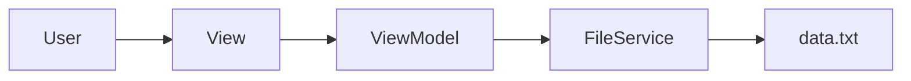
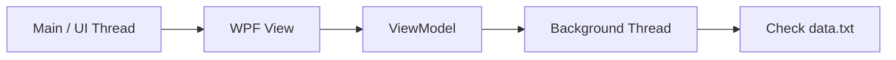
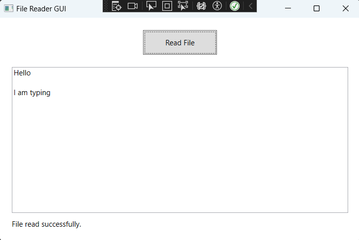

# File Reader GUI

A small introductory WPF project for understanding **MVVM (Model-View-ViewModel)** and basic **threading**.

## Goal

Get familiar with **WPF**, C#, and the basic **MVVM design principle** by building a simple **File Reader GUI** application.

The application allows the user to:

- **Read File** : Read and display the contents of `data.txt`.
- **File Service** : Handle file-related operations separately from the UI.
- **Data Binding** : Display file contents through ViewModel properties.
- **Command Binding** : Use `ICommand` instead of button click events.
- **Background Thread** : Check the file for modifications in a background thread.

## Folder Structure

```text
File_Reader
├── Service
│   └── FileService.cs
│
├── ViewModel
│   ├── MainViewModel.cs
│   └── RelayCommand.cs
│
└── GUI
    ├── App.xaml
    ├── App.xaml.cs
    ├── MainWindow.xaml
    ├── MainWindow.xaml.cs
    └── data.txt
```

---

## MVVM Structure

The project is divided into three main parts:

* **Service** : Handles file-related operations. `FileService` checks whether the file exists, reads the file, and checks its modification time.

* **View** : Represents the user interface. `MainWindow.xaml` contains the Read File button, TextBox, and status message.

* **ViewModel** : Contains the application logic. `MainViewModel` communicates with `FileService`, exposes properties for data binding, and provides the `ReadFileCommand`.

The basic flow is:



## Threading

The **WPF UI runs on the main/UI thread**, which is responsible for handling user interactions and updating the interface.

A **separate background thread** is used to periodically check `data.txt` for file modifications. This keeps the file-checking work separate from the UI thread so that the interface remains responsive.


The main thread handles the GUI, while the background thread checks the file every 500 ms.

---

## Console



---
