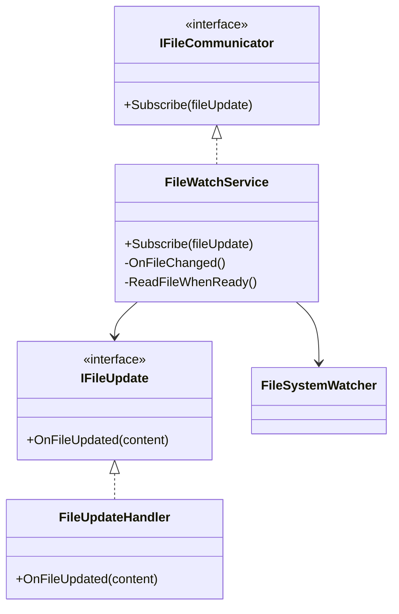

# File Watcher

This is the note for the File Watcher assignment of the Software Engineering course.

## Goal

Design a simple file-watching module that:

* Uses `FileSystemWatcher` to detect `.txt` file changes.
* Uses `IFileCommunicator` for subscribing to updates.
* Uses `IFileUpdate` to notify subscribers with the updated file content.
* Displays the updated content in the `Executive` console application.

---

## Folder Structure

```text
FileWatcher
├── FileWatcher
|   ├── FileWatchService.cs
|   ├── IFileCommunicator.cs
|   └── IFileUpdate.cs
└── Executive
    ├── Program.cs
    └── file.txt
```

---

## Class Diagram



> [!Note]
> `FileSystemWatcher` detects changes, `FileWatchService` reads the updated file, and `IFileUpdate` notifies the `Executive` application.

---
