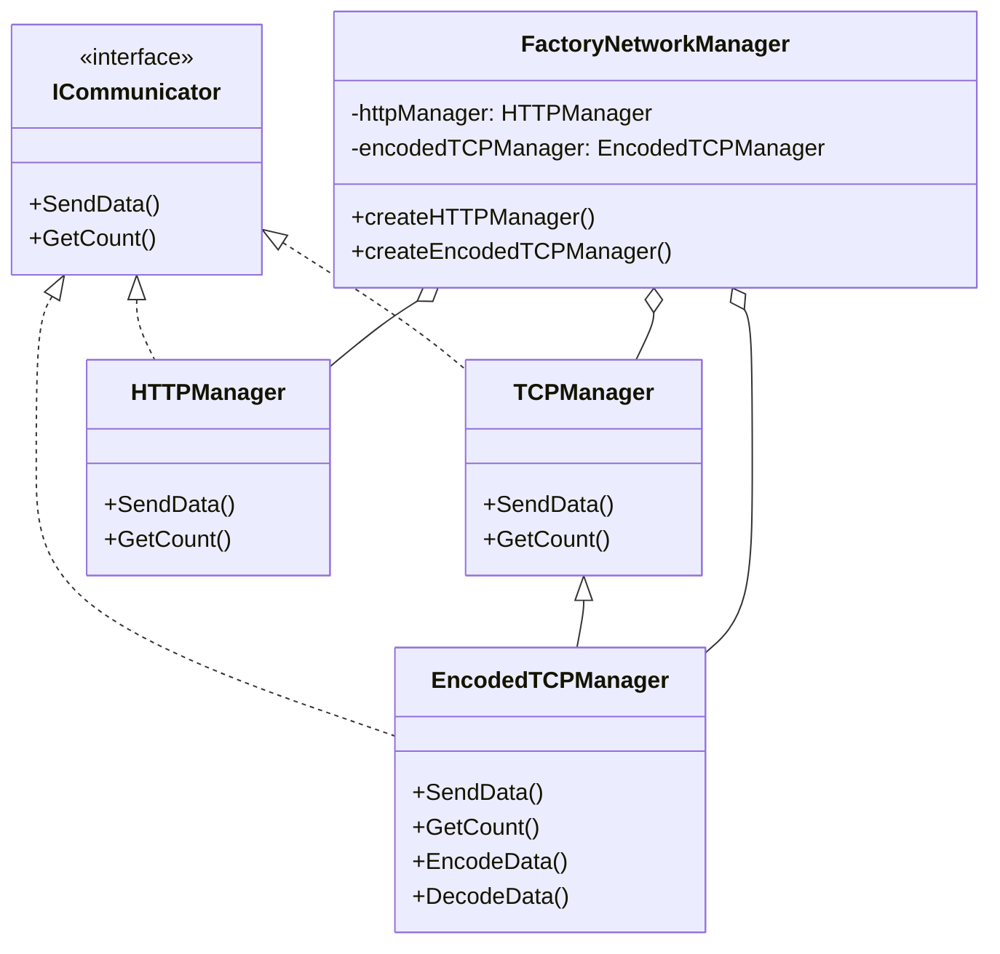

# Network Manager

This is the note for the Network Manager assignment of the Software Engineering course.

## Goal

Design a simple networking module consisting of:

- `TCPManager` and `HTTPManager` implementing `ICommunicator`.
- `EncodedTCPManager` extending `TCPManager` with encoding/decoding support.
- `FactoryNetworkManager` for creating the appropriate network manager based on whether the system is on a LAN.
- No actual TCP/HTTP protocol implementation is required.

Each communicator must provide:
- `SendData()`
- `GetCount()`
---

## The Folder Structure

```
NetworkManager
├── note.md
├── Networking
|   ├── ICommunicator.cs
|   ├── TcpManager.cs
|   ├── HttpManager.cs
|   ├── FactoryNetworkManager.cs
|   └── EncodedTcpManager.cs
└── Executive
    ├── NetworkManager.sln
    └── Program.cs

```

---

## The Class Diagram



> [!Note]
> The ICommunicator interface should be represented with a dotted/dashed border in the class diagram.

---
