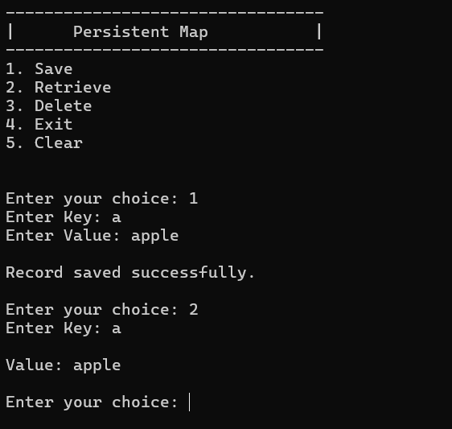

# Persistent Map

A small introductory assignment for the **Software Engineering** course at **IIT Palakkad**.

## Goal

Get familiar with **Visual Studio**, C# project structure, and basic file persistence by building a simple **key-value store**.

The application provides a `FileManager` that stores key-value pairs in a local file and supports:

- **Save** : Add or update a key-value pair.
- **Retrieve** : Retrieve a value using its key.
- **Delete** : Remove a key-value pair.
- **Persistent Storage** : Data is stored in `database.txt` and loaded when the application starts.

## Folder Structure

```text
Persistence_Map
├── Executive
│   ├── Persistence_Map.sln
│   └── Program.cs
└── Persistence
    └── FileManager.cs

```
---

## Implementation

The project is divided into two parts:

* **Executive** : Console application providing the user interface.
* **Persistence** : Class library containing `FileManager`, which handles the key-value data and file storage.

Data is stored in the following format:

```text
key=value
```

---

## The Console




---