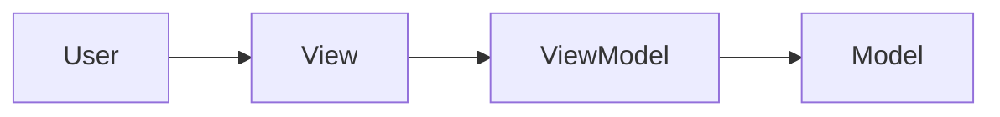
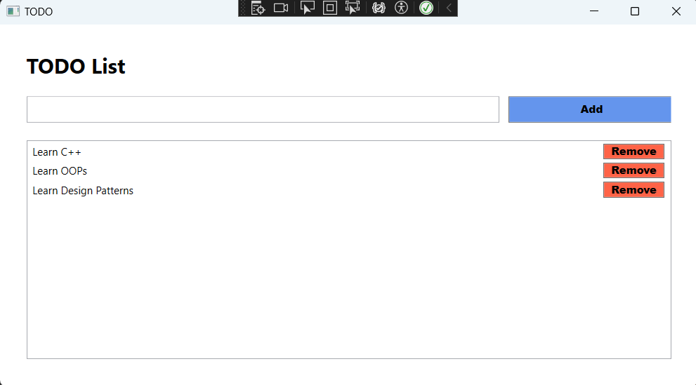

# TODO App

A small introductory WBF project for understanding MVVM.

## Goal

Get familiar with **WPF**, C#, and the basic **MVVM (Model-View-ViewModel)** design principle by building a simple **TODO List** application.

The application allows the user to:

- **Add** : Add a new TODO item.
- **Remove** : Remove an existing TODO item.
- **Display** : Display all added TODO items.
- **In-Memory Storage** : TODO items are stored only while the application is running. No database or file is used.

## Folder Structure

```text
TODO_app
└── TODOApp
    ├── Models
    │   └── TodoItem.cs
    ├── ViewModels
    │   └── MainViewModel.cs
    ├── App.xaml
    ├── App.xaml.cs
    ├── MainWindow.xaml
    └── MainWindow.xaml.cs
```

---

## MVVM Structure

The project is divided into three main parts:

* **Model** : Represents the data of the application. `TodoItem` represents a single TODO item.

* **View** : Represents the user interface. `MainWindow.xaml` contains the TextBox, Add button, ListBox, and Remove buttons.

* **ViewModel** : Contains the application logic. `MainViewModel` maintains the TODO list and provides methods to add and remove items.

The basic flow is:



## Console



---