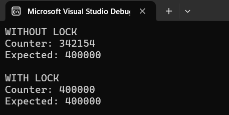

# Threads and Locks

A small introductory code to understand **parallelization using threads**.

## Goal

Get familiar with **C# threads**, `Thread.Join()`, race conditions, and synchronization using the `lock` statement.

The application demonstrates incrementing a global counter using multiple threads in two cases:

- **Without Lock** : Multiple threads increment the counter without synchronization.
- **With Lock** : Access to the counter is synchronized using `lock`.

## Implementation

The project contains a simple console application.

The program creates multiple threads that increment a shared global counter. `Thread.Join()` is used to wait for all threads to finish before displaying the final counter value.

The two implementations are:

```text
IncrementWithoutLock()
IncrementWithLock()
```

The `lock` version uses a shared lock object to ensure that only one thread modifies the counter at a time.

## Expected Output

Without synchronization, the final counter may be less than the expected value due to a **race condition**.

With synchronization, the final counter should match the expected value.

---

## The Console




